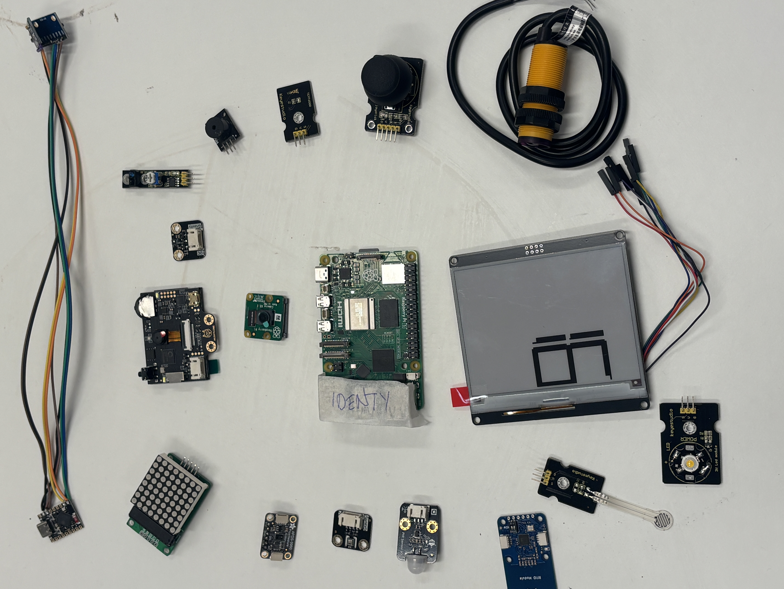
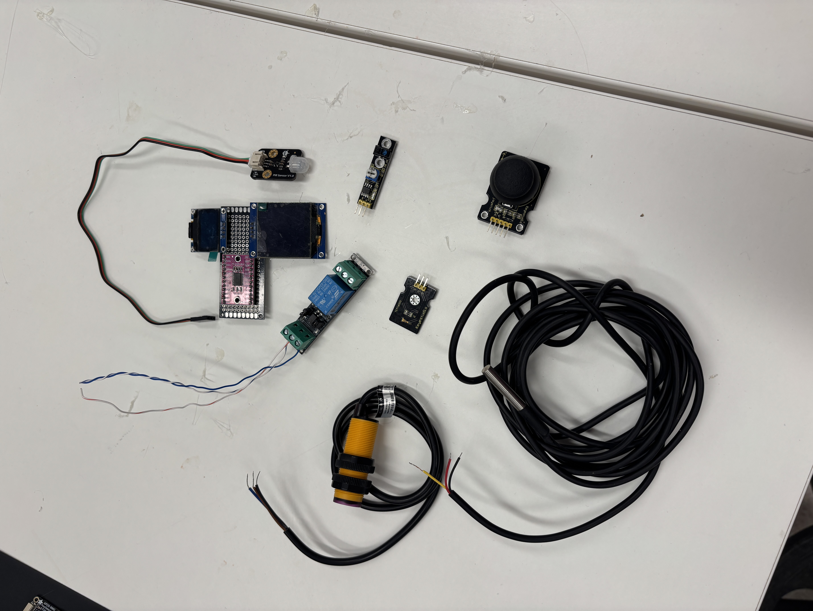
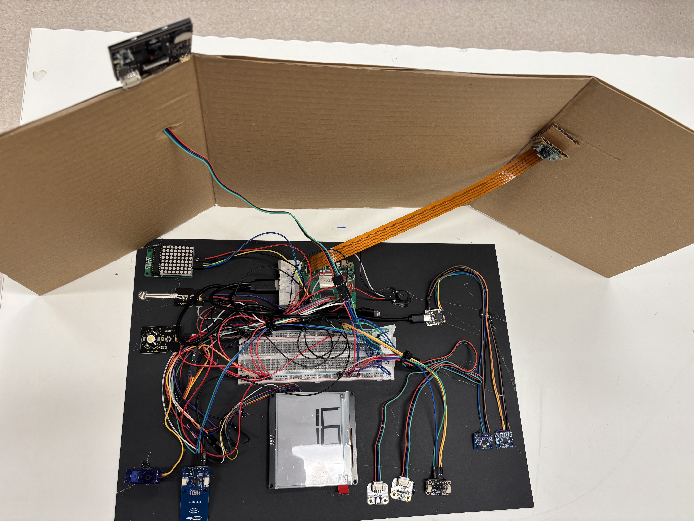

# Build log (humans only — never let this reach the Pi)

Photos and a chronological record of the build, up to but not including power-on. Same rule as README.md and WIRING.md: this file — and every photo in it — shows the machine's own wiring, which is exactly what the agent has to discover for itself. **Never let this file, or the `photos/` folder, reach the Pi.**

## Parts, laid out

The original inventory, spread out for photographing before anything was wired: Pi 5, Pi Camera v2.1, epaper module, joystick, TEMT6000, keyestudio modules, the DFRobot/Adafruit/PiicoDev breakouts, HuskyLens, and the rest. This photo is what got everything in WIRING.md correctly identified — protocol, voltage, and pin — before a single wire went in.

## What didn't make the cut

Install got hard partway through, and scope got trimmed as a result. Left out of the final assembly: the PIR sensor (SEN0171), the relay (SRD-03VDC-SL-C), the joystick, TEMT6000, the Keyestudio IR module, the DS18B20 probe, and — found together but dropped as a set — the I2C multiplexer with both OLEDs attached to it.

None of this is a failure. It's the same thing the thesis calls dead ends elsewhere: iteration and discovery, not wasted effort. The scope that's left is smaller, but it's real, and it's what actually got wired.

## The setup

What's actually built: Pi 5 on a breadboard with the epaper display, 8×8 LED matrix, 3W LED module, piezo buzzer, servo, PiicoDev RFID, and a couple of I2C breakouts. Above it, a cardboard rig holds two cameras — the Pi Camera and HuskyLens — angled to look down at the board and at each other. That's the mirror-test setup from the original concept, built for real out of cardboard and cable ties.

Not yet fully confirmed as-built (see WIRING.md's status list): which of the AHT20/SGP40 pair is actually wired, whether the cap touch module made it in, and whether the ESP32+MPU-6050 subsystem (visible as a small board with an antenna trace) is actually connected.

## Lesson learned: pin wiring needs real attention, not just the 3.3V rule

The original plan leaned on one big rule — 3.3V discipline, no 5V logic on GPIO — and treated everything else as fair game for "quasi-random" wiring. Actually building it showed that's not quite enough on its own. Two things came up during the real wiring pass that could have taken out a GPIO pin, or worse, if they'd gone unnoticed:

- The epaper module's own silkscreen labels its SPI pins **SDA** and **SCL** — the driver chip's alternate I2C-mode pin names — not SCLK/MOSI. Wired at face value against the plan, that's exactly backwards: an SPI clock line landing where an I2C signal was expected, or vice versa, on a board that's otherwise correctly identified. Caught only by cross-checking the full pin list against what SPI epaper panels actually need (see WIRING.md).
- Several small breakout boards look near-identical at a glance — multiple modules with a trimpot and 3–4 pins, several small "Gravity"-branded I2C boards — and the wrong one going on the wrong pin under an already-loose "random" philosophy is a real, not theoretical, way to mismatch voltage or protocol expectations.

The updated rule, now written into README.md's landmines section and WIRING.md's per-device notes: **confirm identity and pin function against the actual part in hand before wiring, not against a guess from a first-glance photo.** "Random" was always meant to apply to *pin choice*, never to *whether the plan matches physical reality* — conflating the two is how something gets blown up. Nothing was actually damaged this time, but it was close enough during the real build to be worth writing down before power-on.

## Process log (before power-on)

- **Concept.** Self-referential Pi: undocumented hardware, an agent with shell access, a camera pointed at its own wiring. Two-file split established early — README.md tells the whole plot, PI.md tells the machine nothing but the task.
- **Wiring plan v1.** Full parts list identified from photos, protocol/voltage/landmine-checked per device, pins assigned (I2C fixed, SPI0 fixed, everything else scattered).
- **Additions and corrections.** Ultrasonic dropped (5V echo pin). Duinotech IR sensor found not to actually be on hand, dropped. DS18B20, mux, two OLEDs, and a relay found and added, then all confirmed not actually included in the final build. Epaper's SDA/SCL silkscreen labels clarified as SPI, not I2C (see lesson above).
- **As-built reconciliation.** WIRING.md rewritten against photos of the real assembly — confirmed drops, confirmed inclusions, open items flagged rather than guessed.
- **Bootstrap plan.** gen (an existing, already-reachable Pi on the network) chosen as the network bridge — `eth0` set to NetworkManager shared mode, IdentyPi gets a DHCP lease and NAT'd internet through gen, reached via `ssh -J gen`. IdentyPi never touches the main LAN. One human keyboard-touch to enable SSH; one human step for Claude Code auth.
- **Diary isolation confirmed.** The machine's own diary is a brand-new, unconnected git repo (`~/identypi-diary`) — never cloned from this repo, so its history can't leak README.md/WIRING.md. `PI.md` reaches the Pi as a plain file copy (`scp`), becoming `CLAUDE.md` there. The diary is local-only — no remote configured, nothing pushed anywhere.

**Status as of this log: not yet powered on.** Physical wiring believed complete per "The setup" above, network bootstrap ready on gen's side, install/auth steps planned but not yet run.
